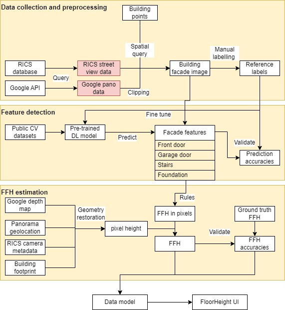

# GA-floor-height

## What this repo does
- This repo contains code for the GA First Floor Height estimation project. It contains multiple folders depending on the data used. Currently the most important folders include:  
- GSV: street view image analysis and FFH estimation for each single building.  
- regression: statistical regression of FFH using raster layers e.g. DEM, DSM.  
- lidar: processing, analysis and FFH estimation using lidar point cloud data for each single building.  
- RICS: analysis of street view car camera images acquired by GA's Rapid Image Collection System.  

There are some other folders that were created/cloned as needed parts of the above explorations:  
- yolov5: cloned model and scripts used for object detection using YOLO v5 model.  
- dem: folder containing notebooks to explore various DEMs resources.  
- data: input vector files for ground truth and building data.  
- superseded: out-of-date notebooks for some abandoned methods.  

An initially proposed main methodology workflow is illustrated as below, which will be updated as we are moving away from GSV and RICS data and using lidar and panorama images newly collected by Woolpert:
  

**Note:** This repo uses conda and pip to manage python environment dependencies specified in the environment.yml file. Other project metadata are included in the [pyproject.toml](pyproject.toml) file. In the future the dependencies list in the .yml file may be moved into the .toml file.  

## Setting up the environment to run the code
- Clone the repository to your local machine
````
git clone https://github.com/frontiersi/GA-floor-height.git
cd GA-floor-height
````
- make sure submodules are properly initialised
````
git submodule update --init --recursive
````
- Create the conda environment for your project  
````
cd GA-floor-height
conda env create -f environment.yml
````
- You should now be up and running with a new repo and conda environment
