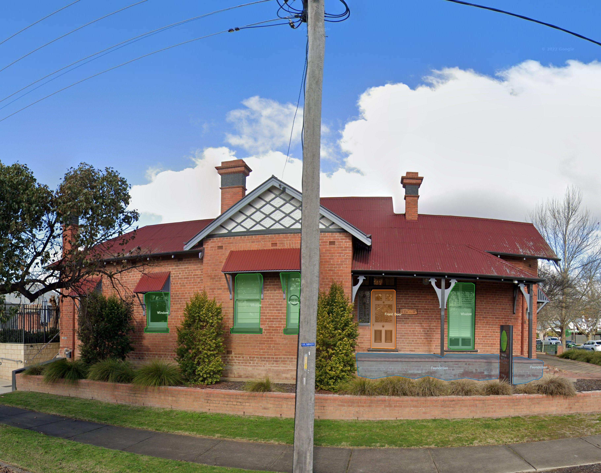
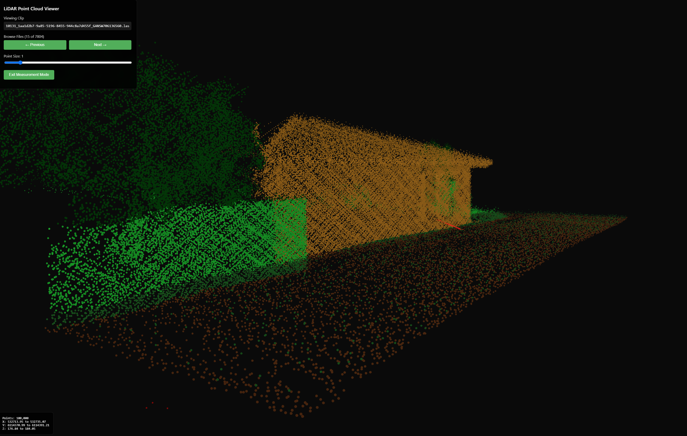

# GA Floor Height Pipeline

## Overview

This pipeline combines computer vision and LiDAR analysis to automatically estimate building first floor heights. The system processes street-view imagery to detect building features, then correlates this with LiDAR point cloud data to calculate accurate first floor height measurements.

### Key Features

**Automated Building Detection** - YOLO-based object detection identifies key building features
**LiDAR Integration** - Precise height measurements from point cloud data
**Intelligent View Selection** - SigLIP scoring selects optimal viewpoints
**Quality Assurance** - Comprehensive validation and ground truth comparison
**Interactive Visualization** - 3D web viewer for exploring results


*Example of object detection results showing identified doors, windows, and building features*

## Pipeline Workflow

The pipeline follows a multi-stage approach:

1. **Data Preparation** (`fh download-data`) - Download LiDAR tiles and street-view trajectory data
1. **LiDAR Clipping** (`fh 1`) - Extract building-specific point clouds from tiles
1. **Image Harvesting** (`fh 2a`) - Identify optimal street-view panorama positions
1. **View Generation** (`fh 2b`, `fh 3`) - Download and clip panoramas to building-focused views
1. **Object Detection** (`fh 4a`) - Detect architectural features (doors, windows, foundations)
1. **Best View Selection** (`fh 4b`) - Use SigLIP scoring to rank and select optimal views
1. **3D Analysis** (`fh 5`, `fh 6`) - Project point clouds and extract ground elevations
1. **Height Estimation** (`fh 7`) - Calculate First Floor Heights (FFH)
1. **Validation** (`fh 8`) - Compare against ground truth measurements

## Setup

### 1. Initial Setup

Run the setup script to install dependencies:

```bash
./setup.sh
```

This will:

- Create a conda environment with required packages
- Install the floor_heights package in development mode
- Set up pre-commit hooks

### 2. Environment Variables

Create a `.env` file in the project root with the following variables:

```bash
# AWS Configuration (required for data download and S3 access)
AWS_ACCESS_KEY_ID=your_access_key_id
AWS_SECRET_ACCESS_KEY=your_secret_access_key
AWS_DEFAULT_REGION=ap-southeast-2

FH_OUTPUT_ROOT=/path/to/output/directory

# Optional: Local LiDAR data path (if not using S3)
FH_LIDAR_DATA_ROOT=/path/to/local/lidar/data

# Optional: Database path (defaults to data/floor_heights.duckdb)
FH_DB_PATH=/path/to/database.duckdb
```

### 3. Initialize Database

Run the database pipeline to set up the initial data:

```bash
fh db pipeline
```

This will:

- Convert raw spatial data to GeoParquet format
- Load data into DuckDB database
- Create necessary tables and indexes

### 4. Download Required Data

Before running the pipeline, download the required trajectory and tileset files:

```bash
# Download data for all regions
fh download-data

# Download data for a specific region
fh download-data -r wagga

# Preview what would be downloaded
fh download-data --dry-run
```

This downloads:

- Trajectory files (FramePosOptimised CSV files)
- Tile index shapefiles (.shp, .shx, .dbf, .prj, .cpg files)

Files are saved to:

- `data/raw/{region}/FramePosOptimised-{region}-rev2.csv`
- `data/raw/{region}/tileset/*.shp` (and related files)

## Running the Pipeline

### Run Individual Stages

```bash
# Stage 1: Clip LiDAR tiles to building footprints
fh 1 --region wagga

# Stage 2a: Harvest candidate panoramas
fh 2a --region wagga

# Stage 2b: Download panorama images
fh 2b --region wagga

# Continue with other stages...
```

### Run Multiple Stages

```bash
# Run stages 1 through 4b for all regions
fh run 1 2a 2b 3 4a 4b

# Run stages for a specific region
fh run 1 2a 2b 3 4a 4b -r wagga

# Run in background using screen
fh run 1 2a 2b 3 4a 4b --screen
```

### Available Pipeline Stages

| Stage  | Command            | Description                                    |
| ------ | ------------------ | ---------------------------------------------- |
| **0**  | `fh download-data` | Download required AWS data files               |
| **1**  | `fh 1`             | Clip LiDAR tiles to residential footprints     |
| **2a** | `fh 2a`            | Harvest candidate panoramas from Street View   |
| **2b** | `fh 2b`            | Download panorama images                       |
| **3**  | `fh 3`             | Clip panoramas to building views               |
| **4a** | `fh 4a`            | Run object detection on clipped panoramas      |
| **4b** | `fh 4b`            | Select best view with SigLIP occlusion scoring |
| **5**  | `fh 5`             | Project point clouds to facade rasters         |
| **6**  | `fh 6`             | Extract ground elevation from clipped LiDAR    |
| **7**  | `fh 7`             | Estimate First Floor Heights (FFH)             |
| **8**  | `fh 8`             | Validate results against ground truth          |

## LiDAR Quality Assurance

The pipeline includes a comprehensive LiDAR QA module to detect and report quality issues in point cloud data.

### Running QA Checks

```bash
# Run QA on LiDAR tiles in a directory
fh qa run /path/to/lidar/tiles -o /path/to/output

# Run QA on specific region's LiDAR data
fh qa run -r wagga

# Run QA on multiple directories
fh qa run dir1 dir2 dir3 -o /path/to/output

# Specify file pattern and workers
fh qa run /path/to/tiles --pattern "*.laz" --workers 32
```

### QA Commands

```bash
# View QA summary for a region or report
fh qa summary                    # Summary of all reports
fh qa summary -r wagga          # Summary for specific region
fh qa summary /path/to/report.parquet  # Summary of specific report

# List tiles with specific issues
fh qa issues /path/to/report.parquet             # All issues
fh qa issues /path/to/report.parquet -s error    # Only error severity
fh qa issues /path/to/report.parquet -s critical # Only critical issues
fh qa issues /path/to/report.parquet -t striping # Specific issue type
```

### QA Checks Performed

The QA module checks for:

- **Geometric Issues**: Striping, misalignment, density variations, data voids
- **Noise & Outliers**: Statistical outliers, isolated points, weather noise
- **Classification Issues**: Misclassification, unclassified points, classification noise
- **Sensor Artifacts**: Edge artifacts, blind spots, ghosting, blooming

## LiDAR Viewer

The pipeline includes an interactive 3D web-based viewer for visualizing clipped LiDAR point clouds and validating floor height estimates.


*Interactive 3D LiDAR viewer showing building point clouds with measurement tools*

### Features

- Interactive 3D visualization of clipped building point clouds
- Browse processed clips by region with metadata
- Measuring tools for validating First Floor Height (FFH) estimates
- Ground truth data creation and validation interface

### Running the Viewer

```bash
# Launch the viewer (opens in browser)
fh viewer launch

# View a specific clip by ID
fh viewer launch 57238_GANSW706146768

# View clips from a specific region
fh viewer launch --region tweed

# Run on a different port
fh viewer launch --port 8080

# Run without opening browser
fh viewer launch --no-open

# Run in development mode
fh viewer launch --dev
```

### Requirements

- Node.js v16 or later must be installed
- The viewer runs a local web server (API on port 8000, frontend on port 3000 by default)

### Viewer Features

- Interactive 3D visualization of clipped building point clouds
- Browse through processed clips by region
- View metadata and statistics for each clip
- Measuring tool for validating First Floor Height (FFH) estimates
- Assists in creating ground truth data for model validation

## Annotation Viewer

View and analyze COCO format segmentation masks for building feature annotations.

```bash
# Launch annotation viewer
fh viewer launch --mode annotate
```

Expects COCO data in `data/datasets/`

### Other Commands

```bash
# List all pipeline stages
fh stages

# List available regions
fh regions

# Check pipeline configuration
fh check

# Show pipeline info
fh info

# Database utilities
fh db pipeline    # Run full database processing pipeline
fh db audit       # Audit database and generate documentation
fh db info        # Show database information and statistics

# YOLO model utilities
fh yolo export      # Export clips containing specific object classes
fh yolo stats       # Show detection statistics by class
fh yolo view        # View detection results in terminal
fh yolo find-rare   # Find high-confidence examples of rare classes
```

## Regions

The pipeline supports three regions:

- `wagga` - Wagga Wagga
- `tweed` - Tweed Heads
- `launceston` - Launceston

## Requirements

- appropriate credentials for AWS
- ~4TB disk space for data and outputs

## Docker

Build and run the pipeline in Docker:

```bash
# Build the image
docker compose build

# Run interactively
docker compose run --rm --entrypoint bash floor-heights
conda activate floor-heights

# Run specific pipeline stage
docker compose run --rm floor-heights fh 1 --region wagga
```
